## CS 2
* `CS 2` [[store.steampowered.com]](https://store.steampowered.com/app/730/CounterStrike_2/)  
    * `启动选项`
        ```
        +fps_max 0 +fps_max_ui 0 -worldwide -nojoy 
        // -worldwide
        // -perfectworld
        // -allow_third_party_software
    * `各项设置菜单`  
        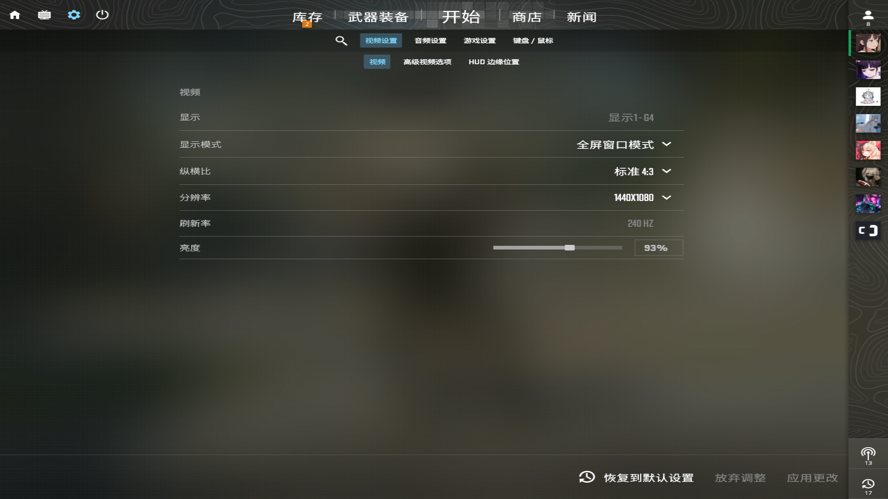  
        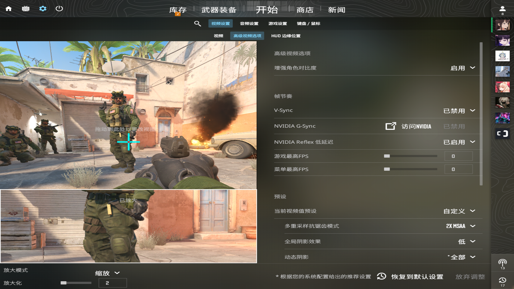  
        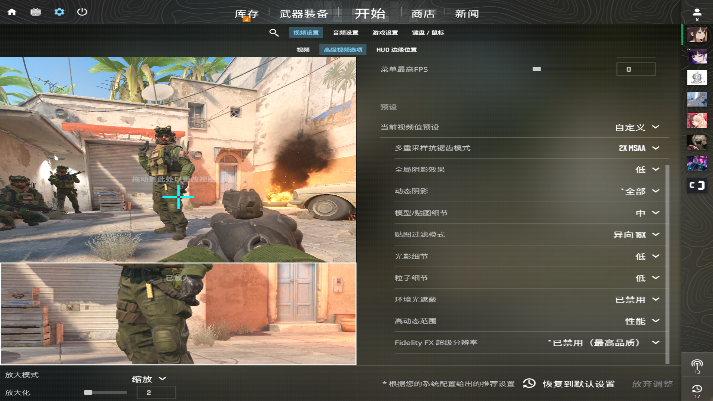  
        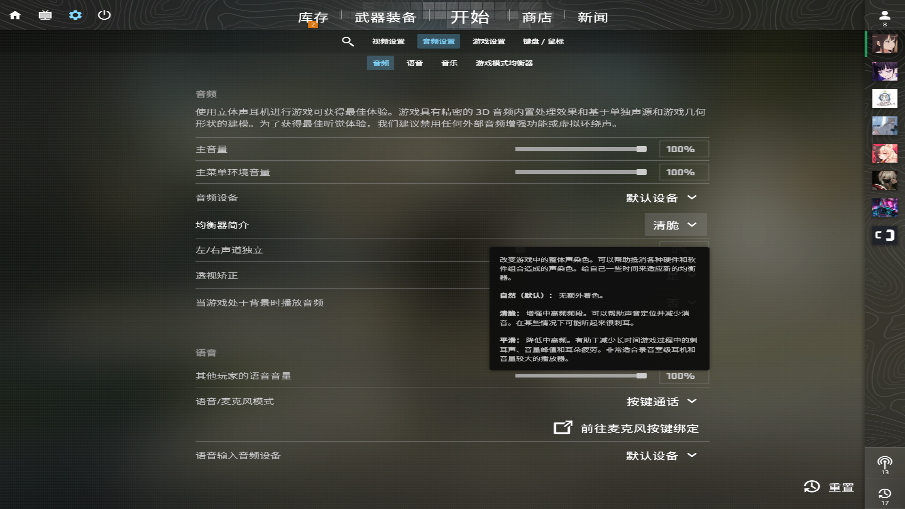  
        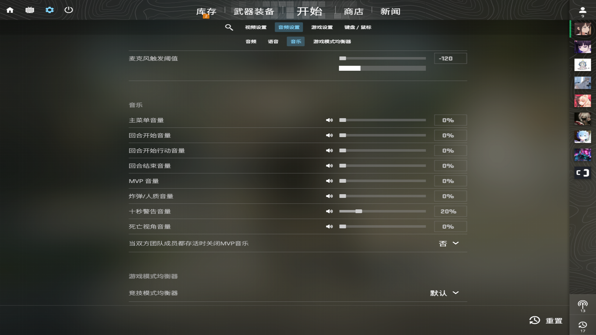  
          
        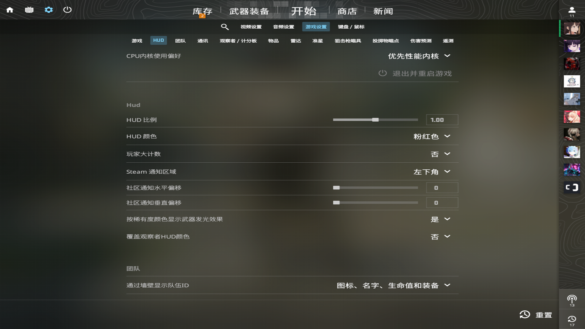  
        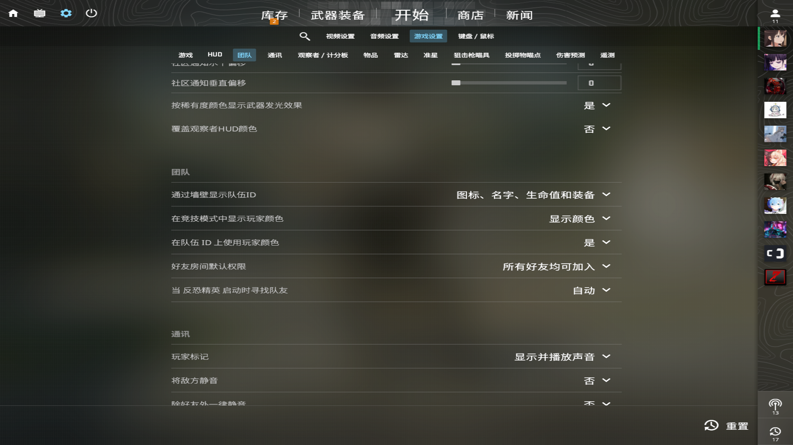  
        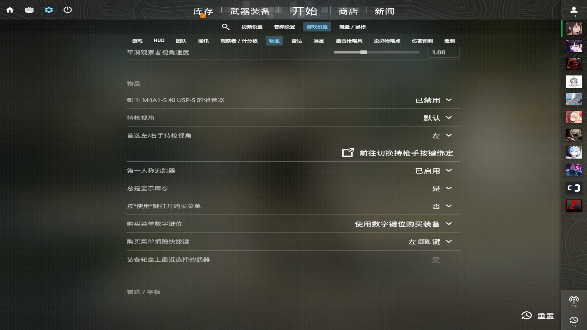  
        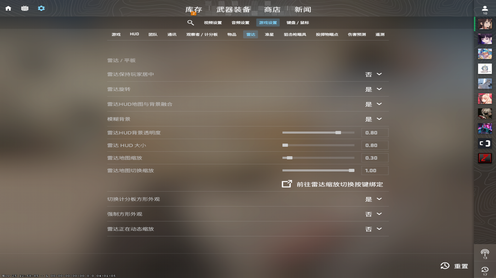
        * `准星`
            ```
            CSGO-EvvTA-D6U88-mXTHk-acm3G-bkMHA
        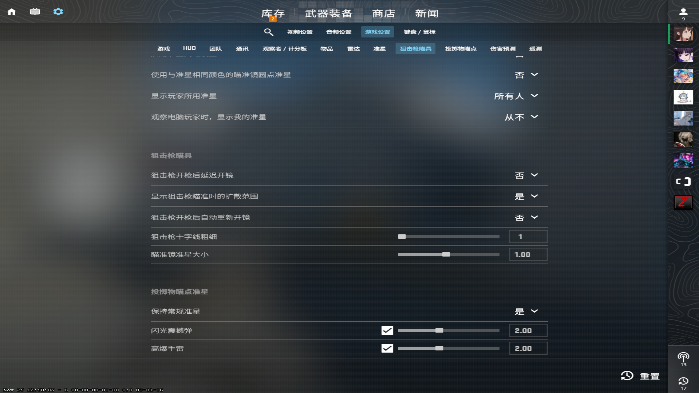  
        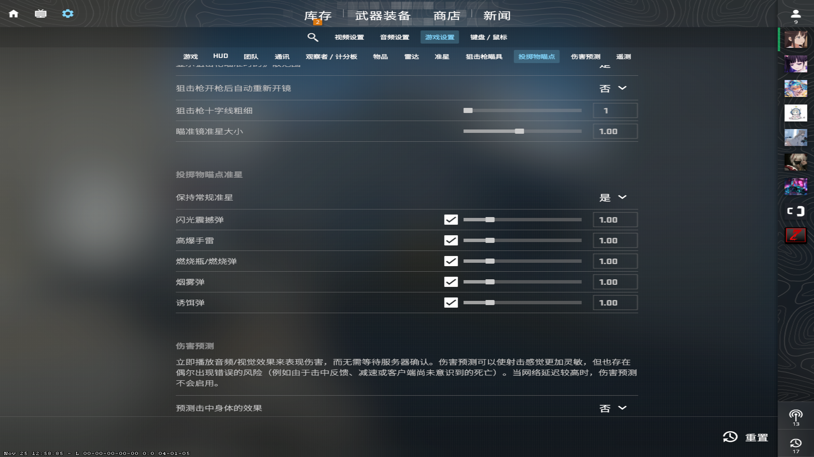  
        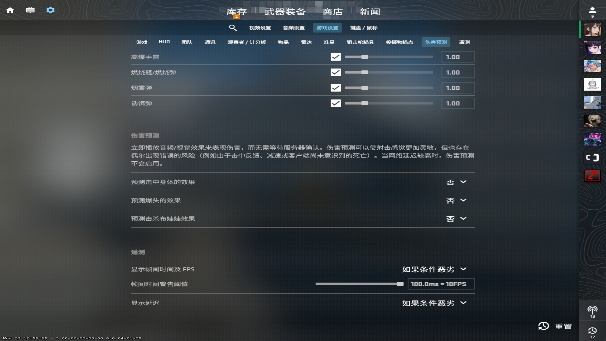  
        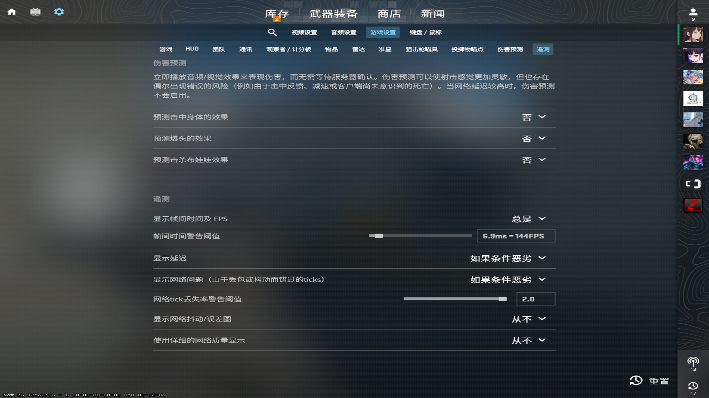
    * `启用开发者控制台`
        ```
        cl_hud_telemetry_frametime_poor 6.94
        cl_hud_telemetry_ping_poor 100
        unbind mwheelup
        unbind mwheeldown
        bind mwheelup +jump
        bind mwheeldown +jump
        bind z slot8
        bind x "slot3;slot7"
        bind c slot6
        bind v slot10
        bind mouse4 +voicerecord
        bind j "say_team .d"
        bind p "say_team .p"
        bind u "say_team .un"
        bind n "say_team .n"
        viewmodel_fov 68
        viewmodel_offset_x 2.5
        viewmodel_offset_y 2
        viewmodel_offset_z -2
        viewmodel_presetpos 0

* `Counter-Striker 2`  
`Process Lasso` [[lrepacks.net]](https://lrepacks.net/repaki-sistemnyh-programm/689-process-lasso-repack-amp-portable.html)  
`cs2.exe`
    * `CPU 优先级` `总是` `高`
    * `CPU 亲和性` `总是` `选择 CPU 亲和性`