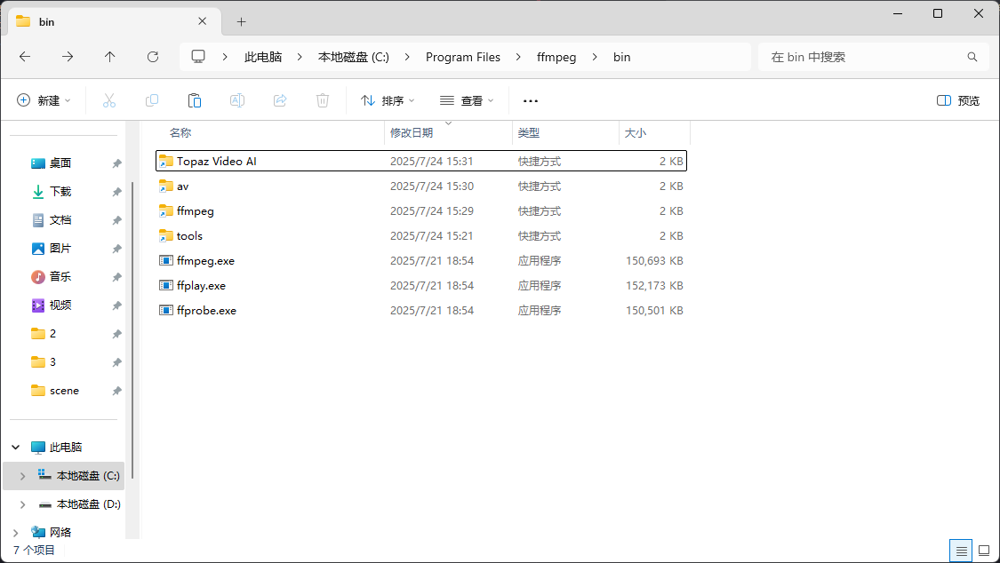

# FFmpeg
* `FFmpeg` [[www.gyan.dev]](https://www.gyan.dev/ffmpeg/builds/#git-master-builds)  
`C:\Program Files\ffmpeg`
    * `libfdk_aac`
        * `source code @ github` [[github.com]](https://github.com/FFmpeg/FFmpeg/commit/222127418b)
        * `MSYS2` [[www.msys2.org]](https://www.msys2.org/)  
        以管理员身份运行 `MSYS2 MINGW64`
            ```
            export http_proxy=http://127.0.0.1:7897

            export https_proxy=http://127.0.0.1:7897

            pacman -Syu

            pacman -S git autoconf automake make libtool mingw-w64-x86_64-gcc nasm pkg-config

            git clone https://github.com/mstorsjo/fdk-aac

            cd fdk-aac

            ./autogen.sh

            ./configure

            make -j$(nproc)

            make install

            cd ..

            git clone https://git.ffmpeg.org/ffmpeg

            cd ffmpeg

            git checkout 222127418bbdee3247eb9c02bb8cf31991e32241

            ./configure --enable-libfdk-aac --enable-nonfree

            make -j$(nproc)

            make install

            cp /mingw64/bin/lib*.dll /mingw64/bin/zlib1.dll .

            cp ffmpeg.exe ffprobe.exe lib*.dll zlib1.dll /c/Program\ Files/ffmpeg/
        * 更新  
        以管理员身份运行 `MSYS2 MINGW64`
            ```
            cd fdk-aac

            git pull

            make distclean

            ./autogen.sh

            ./configure

            make -j$(nproc)

            make install

            cd ..

            cd ffmpeg

            git checkout git checkout 222127418bbdee3247eb9c02bb8cf31991e32241

            make distclean

            ./configure --enable-libfdk-aac --enable-nonfree

            make -j$(nproc)

            make install
    * `Fluent M3U8` [[github.com]](https://github.com/zhiyiYo/Fluent-M3U8/releases)  
    `C:\Program Files (x86)\Fluent-M3U8\tools`
    * `GPL` [[github.com]](https://github.com/Vouk/ffmpeg/releases)  
    `C:\Program Files\ffmpeg`
    * `Flowframes` [[kemono.su]](https://kemono.su/patreon/user/19695417)  
    `C:\Users\a1729\AppData\Local\Flowframes\FlowframesData\pkgs\av`
    * `VMAF-GUI` [[github.com]](https://github.com/ThatNerdUKnow/vmaf-gui/releases)
    
    
    *
* `3FUI` [[github.com]](https://github.com/Lake1059/FFmpegFreeUI/releases)
* `VMAF-GUI` [[github.com]](https://github.com/ThatNerdUKnow/vmaf-gui/releases)