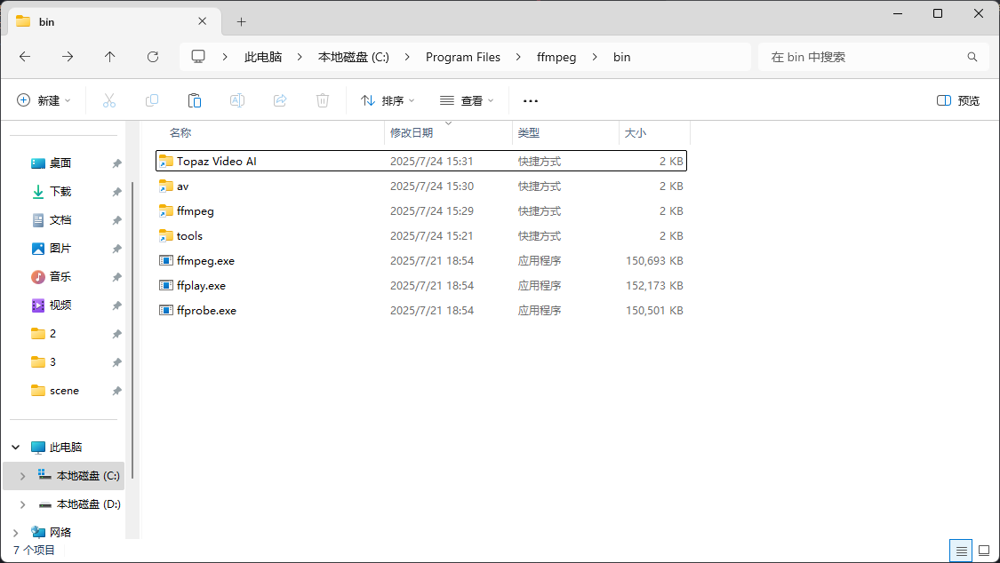

# FFmpeg
* `FFmpeg` [[www.gyan.dev]](https://www.gyan.dev/ffmpeg/builds/#git-master-builds)
    * 科学无损
        ```
        ffmpeg -hide_banner -i input.mp4 -bsf:a:0 aac_adtstoasc -c:v hevc_nvenc -preset p7 -profile:v main -tune hq -rc vbr -cq 0 -b:v 0 -g 600 -bf 0 -pix_fmt yuv420p -vf setsar=1:1 -sws_flags spline+accurate_rnd+full_chroma_int -b_ref_mode disabled -tag:v hvc1 -rc-lookahead 20 -spatial_aq 1 -aq-strength 15 -c:a copy -movflags frag_keyframe+empty_moov+delay_moov+write_colr output.mp4 -y
    * `Fluent M3U8` [[github.com]](https://github.com/zhiyiYo/Fluent-M3U8/releases)  
    `C:\Program Files (x86)\Fluent-M3U8\tools`
    * `GPL` [[github.com]](https://github.com/Vouk/ffmpeg/releases)  
    `C:\Program Files\ffmpeg`
    * `Flowframes` [[kemono.su]](https://kemono.su/patreon/user/19695417)  
    `C:\Users\a1729\AppData\Local\Flowframes\FlowframesData\pkgs\av`
    * `VMAF-GUI` [[github.com]](https://github.com/ThatNerdUKnow/vmaf-gui/releases)
    
    
    *
* `3FUI` [[github.com]](https://github.com/Lake1059/FFmpegFreeUI/releases)
* `VMAF-GUI` [[github.com]](https://github.com/ThatNerdUKnow/vmaf-gui/releases)

ffmpeg -hide_banner -i input -sws_flags spline+accurate_rnd+full_chroma_int -filter_complex flags=lanczos:threads=0 -c:v hevc_nvenc -profile:v main -pix_fmt yuv420p -b_ref_mode disabled -tag:v hvc1 -g 30 -preset p7 -tune hq -rc constqp -qp 17 -rc-lookahead 20 -spatial_aq 1 -aq-strength 15 -b:v 0 -map 0:a? -map_metadata:s:a:0 0:s:a:0 -c:a copy -bsf:a:0 aac_adtstoasc -map_metadata 0 -map_metadata:s:v 0:s:v -fps_mode:v passthrough -bf 0 output

ffmpeg -hide_banner -i input -sws_flags spline+accurate_rnd+full_chroma_int -filter_complex setsar=1 -c:v hevc_nvenc -profile:v main -pix_fmt yuv420p -b_ref_mode disabled -tag:v hvc1 -g 30 -preset p7 -tune hq -rc constqp -qp 17 -rc-lookahead 20 -spatial_aq 1 -aq-strength 15 -b:v 0 -bsf:a:0 aac_adtstoasc output

ffmpeg -hide_banner -nostdin -i "<输入文件>" -sws_flags spline+accurate_rnd+full_chroma_int -b_ref_mode disabled -tag:v hvc1 -spatial_aq 1 -aq-strength 15 -c:v hevc_nvenc -preset p7 -profile main -tune hq -rc constqp -qp 17 -b:v 0 -rc-lookahead 20 -g 30 -bf 0 -pix_fmt yuv420p -vf "scale=1920:-2"  -b:a 320k -channel_layout stereo -ar 48000  -bsf:a:0 aac_adtstoasc "<输出文件>" -y 

-vf setsar=1:1,setpts=PTS/1.5 -af atempo=1.5
-movflags +faststart
