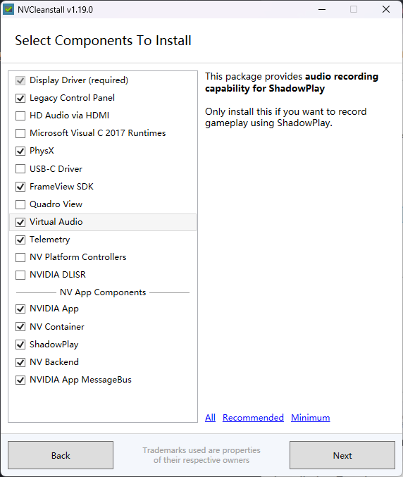
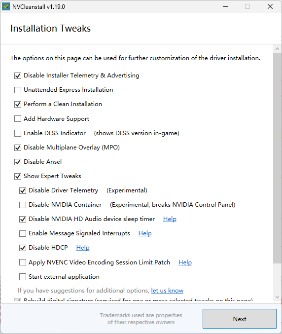
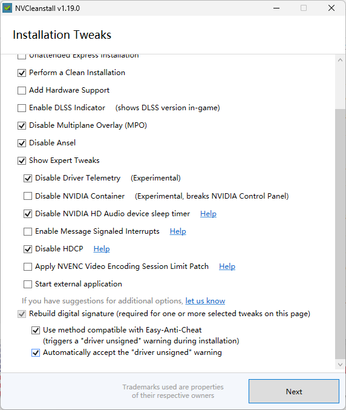
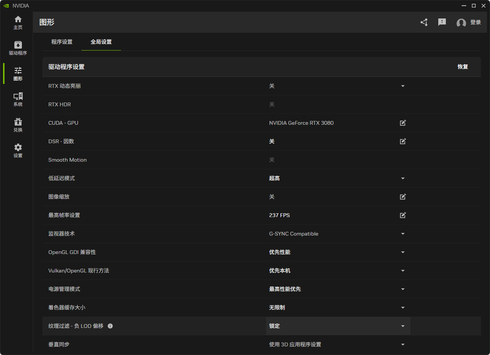
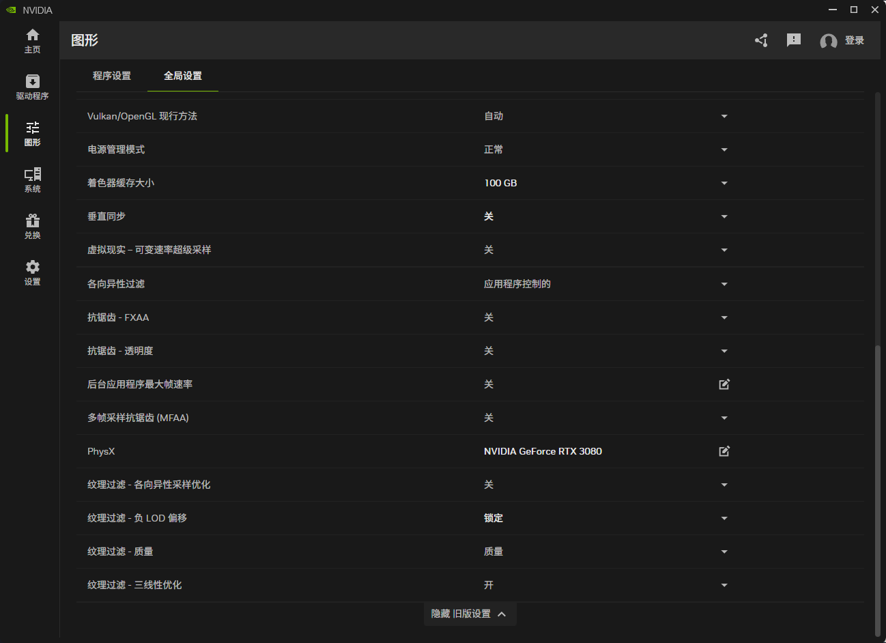
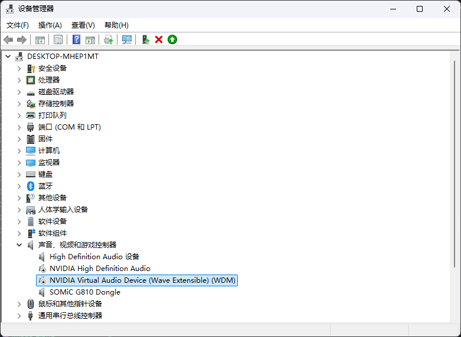

## NVIDIA
* `GeForce Game Ready 驱动程序` [[www.nvidia.cn]](https://www.nvidia.cn/drivers/lookup/)
* `NVCleanstall` [[www.techpowerup.com]](https://www.techpowerup.com/download/techpowerup-nvcleanstall/)  
  
  

* `NVIDIA App` [[www.nvidia.cn]](https://www.nvidia.cn/software/nvidia-app/)  
  

* `NVIDIA 控制面板`
    * `桌面`  
    `启用开发者设置`
    * `管理 3D 设置`
        功能|设置
        -|-
        CUDA - 系统内存回退政策|偏好无系统内存回退政策
    平滑处理 - 灰度纠正|关
    * `管理 GPU 性能计数器`  
    `允许所有用户访问 GPU 性能计数器`

* `设备管理器`  

* `nvidiaProfileInspector` [[github.com]](https://github.com/Orbmu2k/nvidiaProfileInspector/releases)
    nvidiaProfileInspector|Profile Settings
    -|-
    CUDA - Force P2 State|Off
    DLSS - Enable DLL Override|On - DLSS overridden by lastest available
    DLSS - Forced Preset Letter|Preset K
    DLSS-FG - Enable DLL Override|On - DLSS-FG overridden by lastest available
    DLSS-FG - Multi-Frame-Generation Count|2x
    DLSS-RR - Enable DLL Override|On - DLSS-RR overridden by lastest available
    DLSS-RR - Forced Preset Letter|Preset K (unused)
* `Win 1337 Apply Patch` [[github.com]](https://github.com/ramhaidar/Win_1337_Apply_Patch/releases)
    * `NVENC patch` [[github.com]](https://github.com/keylase/nvidia-patch/tree/master/win/win10_x64)  
    * `nvencodeapi64.1337`  
    `C:\Windows\System32`
    * `nvencodeapi.1337`  
    `C:\Windows\SysWOW64`