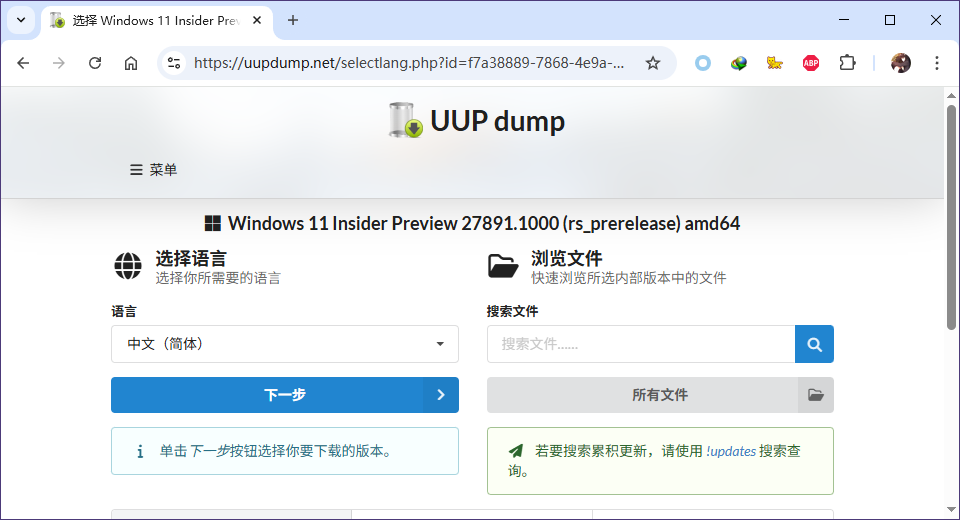
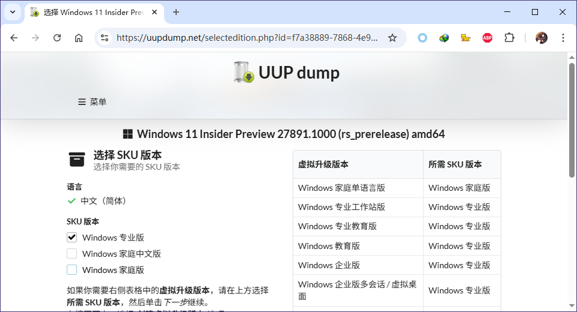
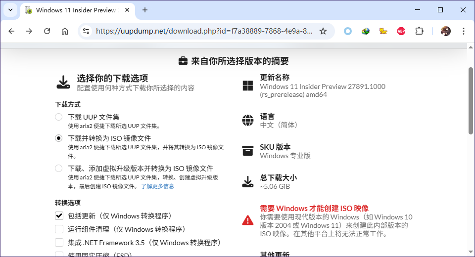

# UUP dump
* `UUP dump` [[uupdump.net]](https://uupdump.net/known.php?q=category:canary)
  
  

* `HotPE` [[www.hotpe.top]](https://www.hotpe.top/download/)
* `终端预览`
    * `保留的存储`
        ```
        dism.exe /online /set-reservedstoragestate /state:disabled
        ```
    * `休眠文件`
        ```
        powercfg -h off
        ```
    * `执行策略`
        ```
        set-executionpolicy -executionpolicy bypass -scope currentuser
        ```