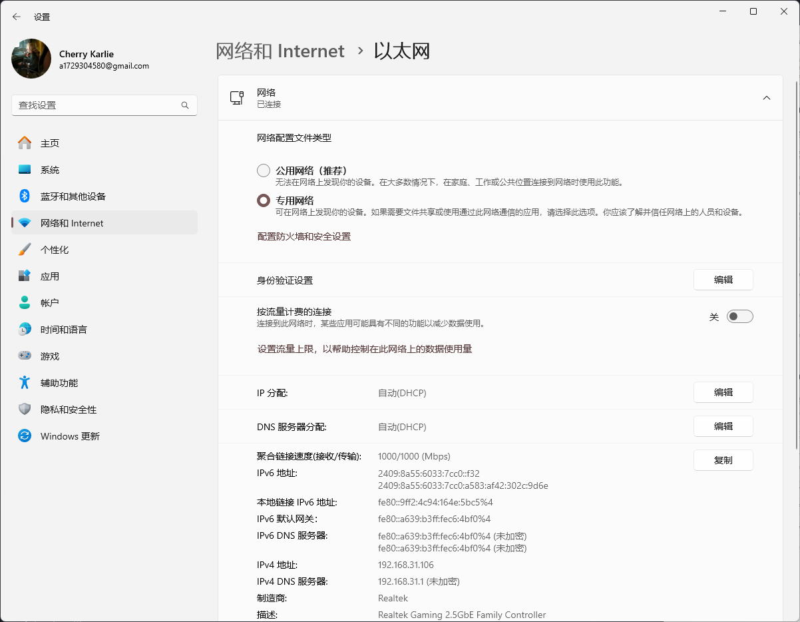

# UUP dump
* `UUP dump` [[uupdump.net]](https://uupdump.net/known.php?q=category:canary)
  
  

* `HotPE` [[www.hotpe.top]](https://www.hotpe.top/download/)
* `HEU_KMS_Activator` [[github.com]](https://github.com/zbezj/HEU_KMS_Activator/releases)
* `设置`  
  
  
  
  
  
  

* `Microsoft Store`
    * `MPEG-2 视频扩展` [[apps.microsoft.com]](https://apps.microsoft.com/detail/9n95q1zzpmh4?hl=zh-cn&gl=CN)
    * `原始图像扩展` [[apps.microsoft.com]](https://apps.microsoft.com/detail/9nctdw2w1bh8?hl=zh-cn&gl=CN)
    * `VP9 视频扩展` [[apps.microsoft.com]](https://apps.microsoft.com/detail/9n4d0msmp0pt?hl=zh-cn&gl=CN)
    * `AV1 Video Extension` [[apps.microsoft.com]](https://apps.microsoft.com/detail/9mvzqvxjbq9v?hl=zh-cn&gl=CN)
    * `Web 媒体扩展` [[apps.microsoft.com]](https://apps.microsoft.com/detail/9n5tdp8vcmhs?hl=zh-cn&gl=CN)
    * `HEIF 图像扩展` [[apps.microsoft.com]](https://apps.microsoft.com/detail/9pmmsr1cgpwg?hl=zh-cn&gl=CN)
    * `OpenCL™、OpenGL® 和 Vulkan® 兼容包` [[apps.microsoft.com]](https://apps.microsoft.com/detail/9nqpsl29bfff?hl=zh-cn&gl=CN)
    * `Webp 图像扩展` [[apps.microsoft.com]](https://apps.microsoft.com/detail/9pg2dk419drg?hl=zh-cn&gl=CN)
    * `AVC Encoder Video Extension` [[apps.microsoft.com]](https://apps.microsoft.com/detail/9pb0trcnrhfx?hl=zh-cn&gl=CN)
* `终端预览`
    * `保留的存储`
        ```
        dism.exe /online /set-reservedstoragestate /state:disabled
        ```
    * `休眠文件`
        ```
        powercfg -h off
        ```
    * `执行策略`
        ```
        set-executionpolicy -executionpolicy bypass -scope currentuser
        ```
* `英特尔驱动程序和支持助理` [[intel.cn]](https://www.intel.cn/content/www/cn/zh/support/intel-driver-support-assistant.html)
* `IObit Driver Booster` [[lrepacks.net]](https://lrepacks.net/repaki-sistemnyh-programm/161-iobit-driver-booster-professional-repack-amp-portable.html)