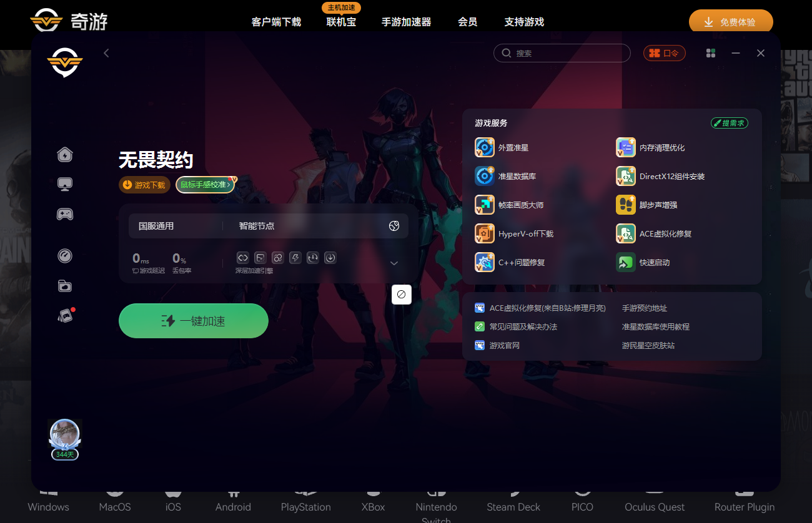
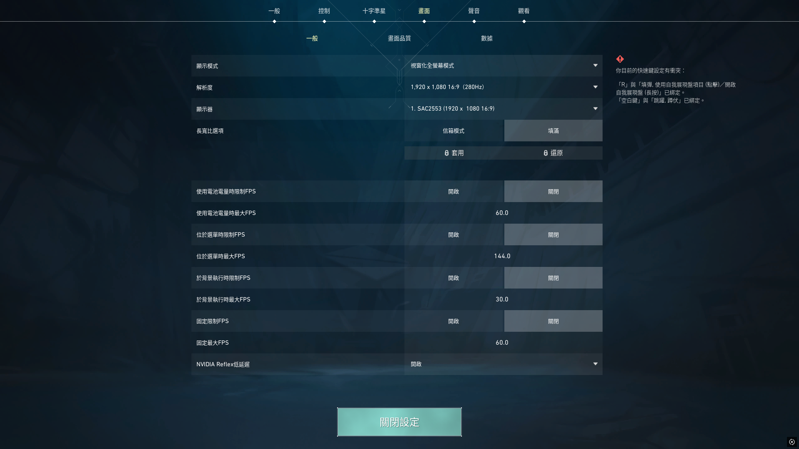
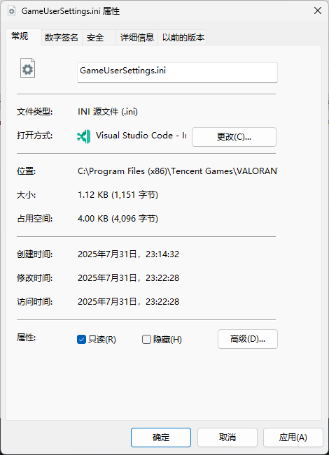

# 特战英豪
* `特战英豪` [[playvalorant.com]](https://playvalorant.com/zh-tw/download/)
* `无畏契约` [[val.qq.com]](https://val.qq.com/main.html)
* `ACE 虚拟化修复` [[www.qiyou.cn]](https://www.qiyou.cn/) / [[space.bilibili.com]](https://space.bilibili.com/355032902)  

* `4:3`
    * `运行`
        ```
        %localappdata%\VALORANT\Saved\Config
        ```
    * 删除`Config`  
        * `C:\Users\a1729\AppData\Local\VALORANT\Saved\Config`
        * `C:\Program Files (x86)\Tencent Games\VALORANT\live\ShooterGame\Saved\Config`
    * `进入游戏`
        * `显示模式`
        * `长宽比选项`

        
        * `退至桌面`
    * 编辑`GameUserSettings.ini`
        ```
        bShouldLetterbox=False
        bLastConfirmedShouldLetterbox=False

        ResolutionSizeX=1440
        ResolutionSizeY=1080
        LastUserConfirmedResolutionSizeX=1440
        LastUserConfirmedResolutionSizeY=1080

        FullscreenMode=2
        ```
        * `属性`  
        
        * `C:\Program Files (x86)\Tencent Games\VALORANT\live\ShooterGame\Saved\Config\WindowsClient`